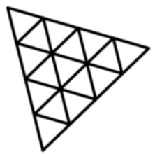

## Hi there!, I'm Lotiyu~

_A collage student who passionates creating useful things with programming power._

I am a visionary creative developer, an intrepid Azure explorer and an illuminating content architect.  
My journey into programming began in primary school, ignited purely by the profound, unadulterated joy of creation itself.

**I hold sacred the philosophy of code aesthetics.** 
 
_Every line must breathe elegance, every structure must resonate with intention. I rigorously eschew redundancy and duplication._

### ***“Code possesses a soul; creation knows no horizon.”***

Explore my digital sanctuary: https://neonangelthreads.github.io/  
Reach me in confidence: pienadev495@gmail.com
 

### 🛠️ I'm using:

### 🌱 I’m currently learning:

<!--
Here are some ideas to get you started:

- 🔭 I’m currently working on ...
- 🌱 I’m currently learning ...
- 👯 I’m looking to collaborate on ...
- 🤔 I’m looking for help with ...
- 💬 Ask me about ...
- 📫 How to reach me: ...
- 😄 Pronouns: ...
- ⚡ Fun fact: ...
-->